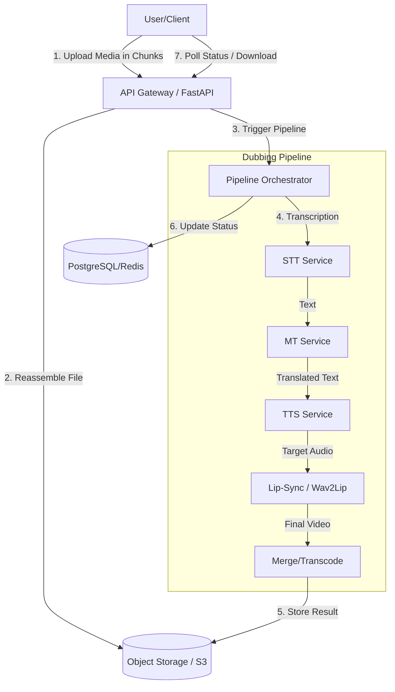
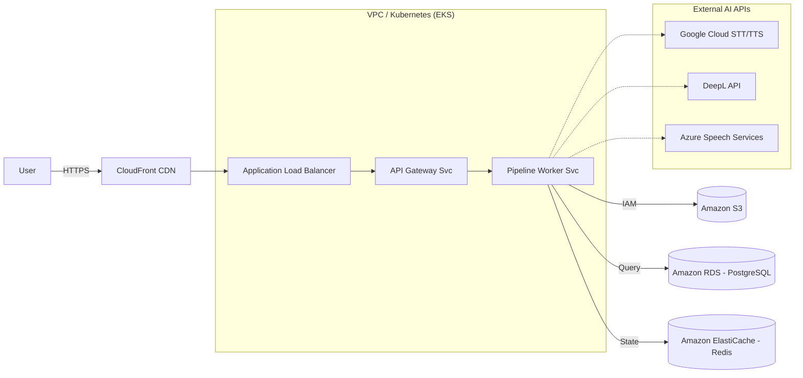

# Architecture - Multilingual Voice Dubbing Platform

## Overview
The platform uses a microservices-based architecture to provide automated video translation and dubbing. The system is designed to be scalable, secure, and GDPR-compliant.

## Dubbing Pipeline Flow
The following diagram illustrates the end-to-end processing of a video file.

## Cloud Infrastructure (AWS Example)
The platform is designed to run in a containerized environment with auto-scaling capabilities.

## Key Components

### 1. API Gateway (FastAPI)
- Handles authentication (OAuth/JWT).
- Manages chunked uploads for large files (up to 700MB+).
- Enforces security headers and CORS.
- Provides project management and status tracking.

### 2. Chunked Upload System
- `init`: Generates a unique `upload_id`.
- `chunk`: Receives and stores individual file segments.
- `complete`: Merges chunks into a final file and triggers processing.

### 3. Dubbing Pipeline
- **STT (Speech-to-Text)**: Extracts text from the source audio.
- **MT (Machine Translation)**: Translates the extracted text to the target language.
- **TTS (Text-to-Speech)**: Generates a natural-sounding voice in the target language.
- **Lip-Sync (Wav2Lip)**: Synchronizes the video's lip movements with the new audio.

### 4. GDPR Compliance
- Explicit consent is required for biometric data processing (voice).
- Data retention policies are enforced (auto-deletion after X days).
- Support for "Right to be Forgotten" (data deletion on request).

## Metrics and Quality Control
- **WER (Word Error Rate)**: Measures transcription accuracy.
- **MOS (Mean Opinion Score)**: Evaluates synthetic voice quality.
- **LSE-D (Lip Sync Error - Distance)**: Measures the quality of lip synchronization.
- **Latence**: Targeted at <30s per minute of audio.
