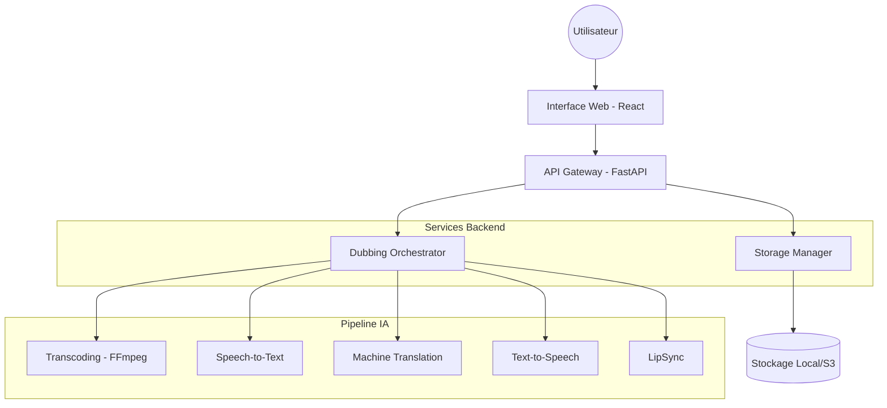
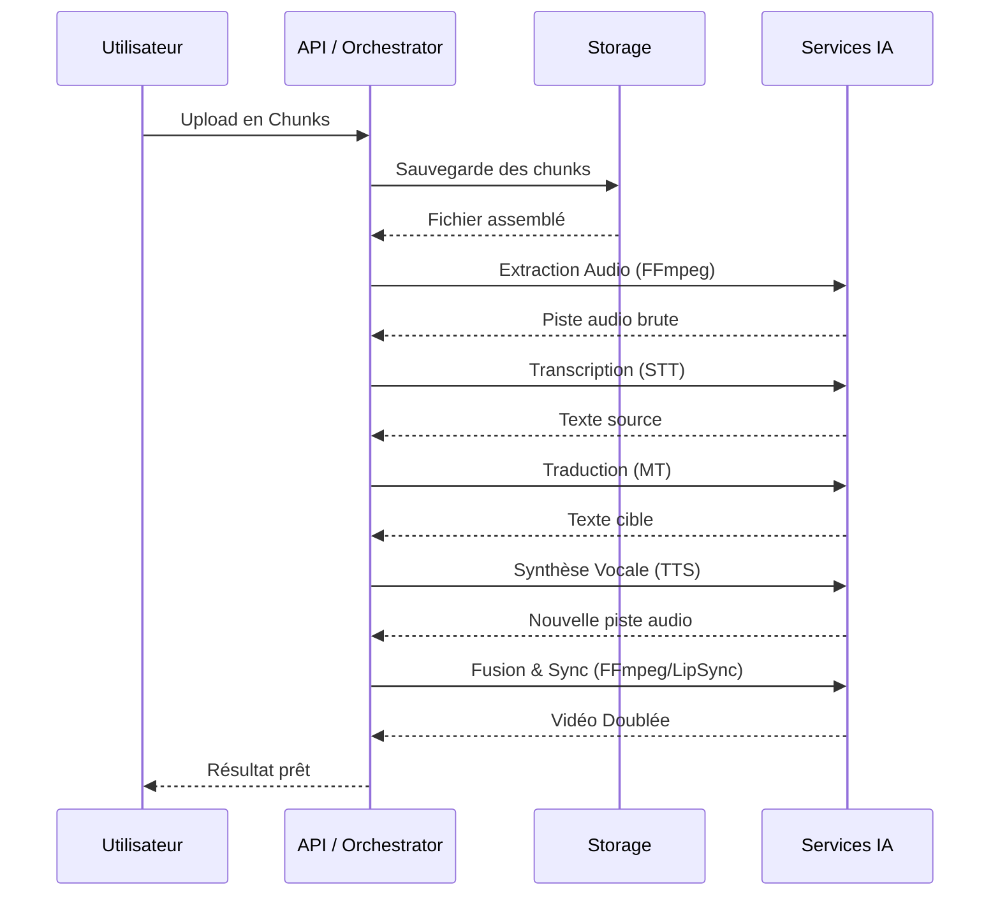

# Architecture du Système

Ce document décrit l'architecture technique de la plateforme de doublage vocal IA.

## Vue d'ensemble de l'Architecture

La solution repose sur une architecture en couches facilitant la scalabilité et la maintenance.

## Flux de Données - Pipeline de Doublage

Le diagramme suivant illustre le cheminement d'un fichier média à travers le pipeline de traitement.

## Composants Techniques

- **FastAPI** : Framework principal pour l'API asynchrone.
- **FFmpeg** : Outil de traitement média pour le transcodage et le multiplexage.
- **Storage Manager** : Gère l'isolation des données par utilisateur et le cycle de vie des fichiers.
- **Orchestrator** : Gère la machine à états des jobs de doublage.
- **Pydantic** : Validation des schémas de données.

## Évolutivité et Persistance (Production)

Dans un environnement de production (ex. Kubernetes), les états en mémoire (`upload_sessions` et `orchestrator.jobs`) doivent être déportés vers des systèmes de stockage distribués :
- **Redis** : Pour la gestion des sessions d'upload et le caching.
- **Base de données (PostgreSQL/SQLite)** : Pour la persistance à long terme des jobs et des métadonnées utilisateurs.
- **File d'attente (RabbitMQ/Celery)** : Pour le traitement asynchrone robuste des fichiers volumineux.

## Sécurité et Conformité

- **Isolation** : Chaque utilisateur dispose d'un répertoire dédié `uploads/{user_id}`.
- **RGPD** : Endpoints dédiés pour le droit à l'oubli et l'accès aux données. Consentement explicite requis pour le traitement biométrique.
- **Auth** : Validation par clé API et simulation de jetons OAuth.
