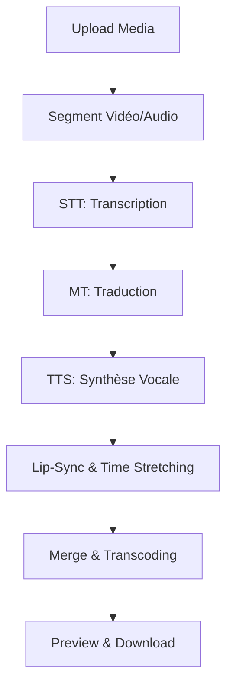
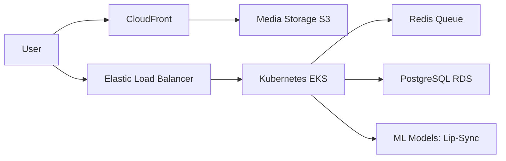

# 🏛️ Architecture du Système

Ce document décrit l'architecture technique de la plateforme de doublage vocal multilingue.

## 🔄 Pipeline de Traitement

Le pipeline suit un flux asynchrone pour traiter les médias volumineux de manière fiable.

## 🏗️ Microservices

L'architecture est composée de plusieurs services spécialisés :

1.  **API Gateway**: Gère l'authentification (OAuth), le routing et les limites de débit.
2.  **Upload Service**: Gère l'ingestion de fichiers volumineux via chunks sur S3.
3.  **STT Service**: Service de reconnaissance vocale (Whisper, Google Speech-to-Text).
4.  **Translation Service**: Gère la traduction du texte (DeepL, Google Translate).
5.  **TTS Service**: Génère l'audio doublé (Azure TTS, Amazon Polly).
6.  **Processing Service**: Coordonne le Lip-Sync (Wav2Lip) et le montage final (FFmpeg).
7.  **Quality Metrics Service**: Calcule le WER, MOS et la latence.

## ☁️ Infrastructure Cloud (AWS)

## 🔐 Sécurité & Conformité

- **OAuth 2.0**: Intégration Gmail/Facebook pour l'authentification.
- **TLS 1.3**: Chiffrement de tous les transferts de données.
- **AES-256**: Chiffrement des fichiers au repos dans le stockage objet.
- **Consentement RGPD**: Enregistrement explicite du consentement avant traitement de la voix (donnée biométrique).
- **DPIA**: Étude d'impact sur la vie privée réalisée.

## 📊 Monitoring & Qualité

- **Prometheus/Grafana**: Monitoring de la latence et du débit.
- **ELK Stack**: Centralisation des logs.
- **Quality Benchmarks**:
    - **WER** (Word Error Rate) < 10% ciblé.
    - **MOS** (Mean Opinion Score) > 4.0 ciblé.
