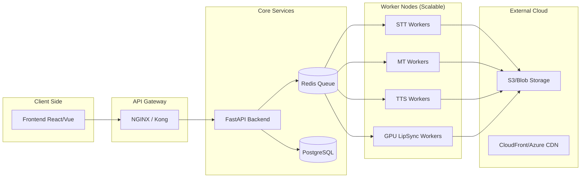

# 🏗️ Architecture Technique - Plateforme de Doublage

Ce document détaille l'organisation technique de la plateforme de doublage vocal multilingue.

## 🔄 Pipeline de Traitement (Data Flow)

Le pipeline est conçu pour être asynchrone et distribué afin de gérer efficacement les fichiers volumineux et les traitements IA intensifs.

```mermaid
graph TD
    A[Upload Média (Chunks)] --> B{Stockage S3/Blob}
    B --> C[Microservice Transcription (STT)]
    C --> D[Extraction Texte + Timestamps]
    D --> E[Microservice Traduction (MT)]
    E --> F[Texte Traduit]
    F --> G[Microservice Synthèse Vocale (TTS)]
    G --> H[Audio Doublé (Prosodie ajustée)]
    H --> I[Microservice Lip-Sync (Wav2Lip)]
    I --> J[Vidéo Finalisée (FFmpeg)]
    J --> K[Stockage Final + CDN]
    K --> L[Notification Utilisateur]
```

## 🏢 Architecture Microservices

L'infrastructure utilise Kubernetes pour l'orchestration et Redis comme gestionnaire de tâches.



## 🛠️ Composants Techniques

### 1. Ingestion de Médias
- **Upload chunked** : Utilisation de `python-multipart` pour recevoir les segments et `aiofiles` pour l'assemblage.
- **Stockage temporaire** : Les fichiers sont stockés localement sur un volume partagé ou directement sur S3 pendant le traitement.

### 2. Services d'IA
- **Transcription (STT)** : Intégration de modèles OpenAI Whisper (OSS) pour la précision et Google Speech-to-Text pour la rapidité.
- **Traduction (MT)** : Utilisation de DeepL API pour sa supériorité sur les nuances linguistiques.
- **Synthèse Vocale (TTS)** : Google Cloud TTS et Azure Neural TTS pour la gestion SSML (prosodie).
- **Lip-Sync** : Modèle Wav2Lip conteneurisé s'exécutant sur des instances avec GPU.

### 3. Orchestration des Tâches
- **Redis/Celery** : Gestion de la file d'attente des jobs asynchrones.
- **Monitoring** : Prometheus pour les métriques et Grafana pour la visualisation de la latence et du débit.

## 🛡️ Sécurité et Fiabilité
- **Isolation** : Chaque traitement s'exécute dans un conteneur isolé.
- **Résilience** : Mécanismes de "Circuit Breaker" sur les appels aux API externes.
- **Chiffrement** : Données chiffrées au repos (AES-256) et en transit (TLS 1.3).
