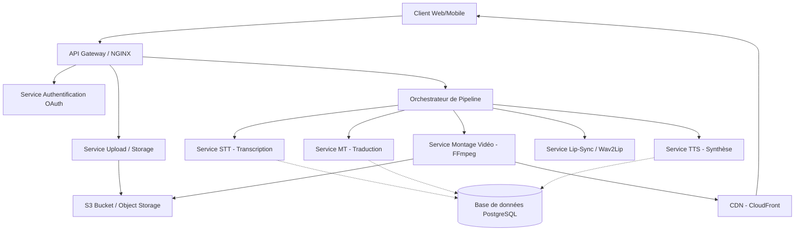

# Architecture du Système

## 1. Vue d'ensemble des Microservices

## 2. Infrastructure Cloud (AWS)

- **Ingestion** : AWS MediaConnect.
- **Encodage** : AWS MediaLive.
- **Packaging** : AWS MediaPackage.
- **Distribution** : Amazon CloudFront.
- **Traitement IA** : Instances GPU (EC2 G4/G5) pour Wav2Lip et Whisper.
- **Stockage** : Amazon S3.

## 3. Flux de Données

1. L'utilisateur charge un média en segments (chunks).
2. Le service d'upload assemble les segments dans S3.
3. Un message est envoyé dans une queue (RabbitMQ/SQS).
4. Le Pipeline worker récupère le job :
   - Extrait l'audio.
   - Envoie l'audio au service STT.
   - Envoie le texte au service MT.
   - Génère l'audio via TTS.
   - Applique le Lip-Sync sur la vidéo originale.
   - Fusionne l'audio et la vidéo.
5. Notification à l'utilisateur de la fin du traitement.
