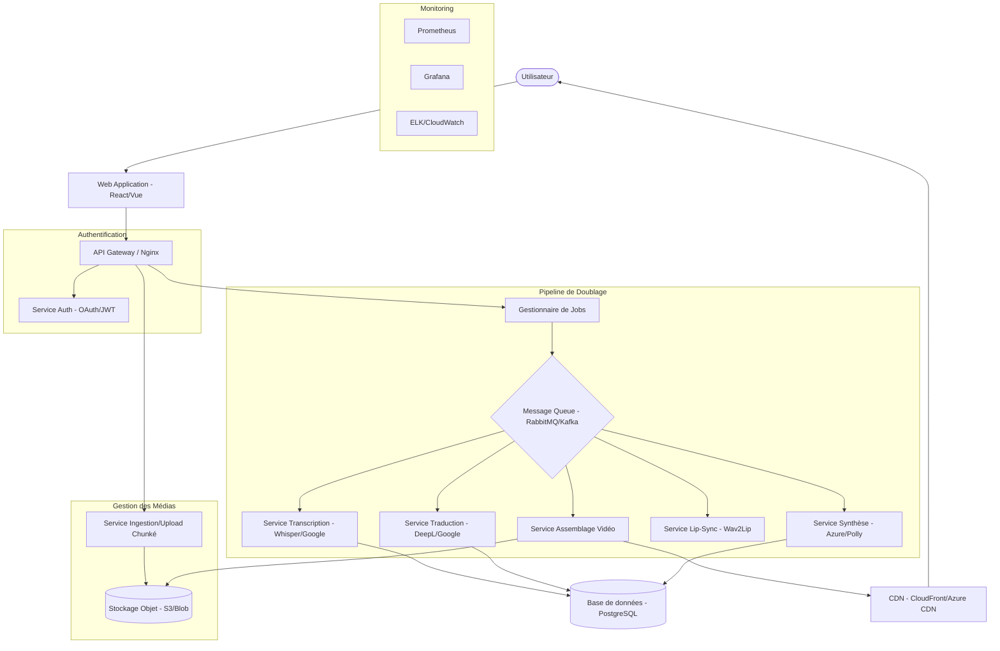
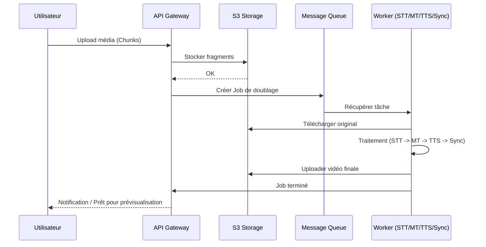

# Architecture du Système

## Diagramme des Microservices

```mermaid
graph TD
    User([Utilisateur]) --> WebApp[Web Application - React/Vue]
    WebApp --> Gateway[API Gateway / Nginx]

    subgraph "Authentification"
        Gateway --> Auth[Service Auth - OAuth/JWT]
    end

    subgraph "Gestion des Médias"
        Gateway --> Upload[Service Ingestion/Upload Chunké]
        Upload --> S3[(Stockage Objet - S3/Blob)]
    end

    subgraph "Pipeline de Doublage"
        Gateway --> JobManager[Gestionnaire de Jobs]
        JobManager --> Queue{Message Queue - RabbitMQ/Kafka}
        Queue --> STT[Service Transcription - Whisper/Google]
        Queue --> MT[Service Traduction - DeepL/Google]
        Queue --> TTS[Service Synthèse - Azure/Polly]
        Queue --> Sync[Service Lip-Sync - Wav2Lip]
        Queue --> FFmpeg[Service Assemblage Vidéo]
    end

    STT --> DB[(Base de données - PostgreSQL)]
    MT --> DB
    TTS --> DB
    FFmpeg --> S3

    subgraph "Monitoring"
        Prometheus[Prometheus]
        Grafana[Grafana]
        Logs[ELK/CloudWatch]
    end

    FFmpeg --> CDN[CDN - CloudFront/Azure CDN]
    CDN --> User
```

## Flux de Données (Séquence)

```mermaid
sequenceDiagram
    participant U as Utilisateur
    participant API as API Gateway
    participant S3 as S3 Storage
    participant Q as Message Queue
    participant W as Worker (STT/MT/TTS/Sync)

    U->>API: Upload média (Chunks)
    API->>S3: Stocker fragments
    S3-->>API: OK
    API->>Q: Créer Job de doublage
    Q->>W: Récupérer tâche
    W->>S3: Télécharger original
    W->>W: Traitement (STT -> MT -> TTS -> Sync)
    W->>S3: Uploader vidéo finale
    W->>API: Job terminé
    API-->>U: Notification / Prêt pour prévisualisation
```
