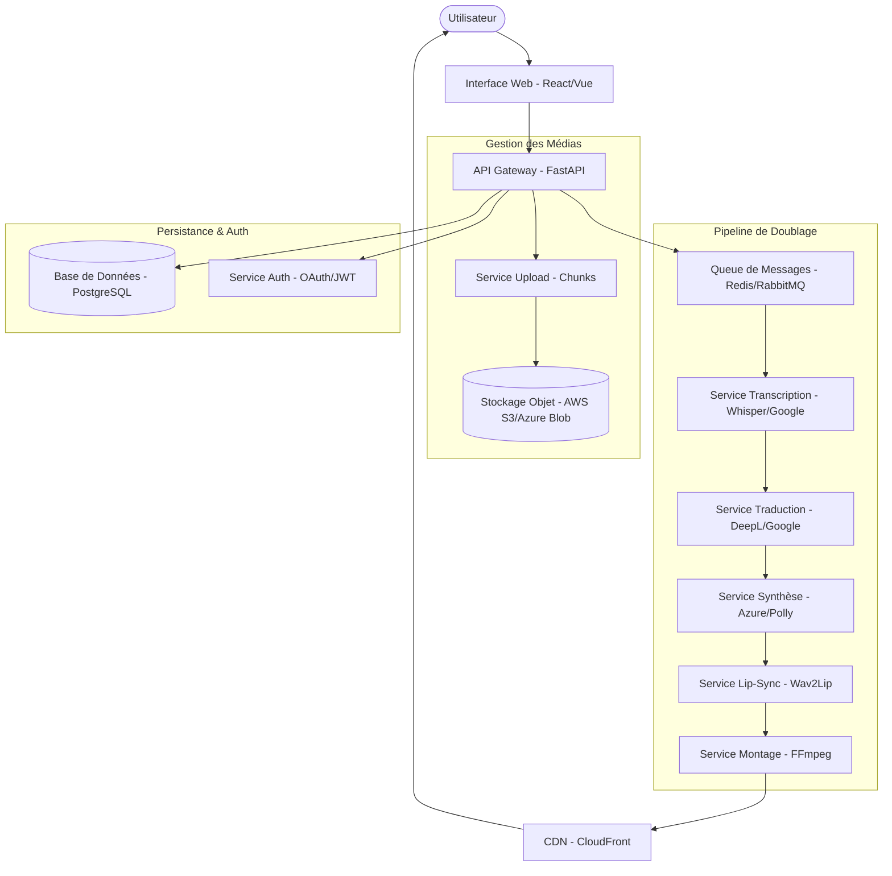

# Architecture du Système

Ce document décrit l'architecture technique de la plateforme de doublage.

## 🏗️ Architecture Globale (Microservices)

Le système utilise une architecture orientée services pour garantir la scalabilité et la modularité.

## 🔄 Flux de Données du Pipeline

1. **Ingestion** : Upload par chunks vers le stockage objet.
2. **Extraction** : FFmpeg extrait la piste audio originale.
3. **Transcription (STT)** : Génération du script texte avec timestamps.
4. **Traduction (MT)** : Traduction du script dans la langue cible.
5. **Synthèse (TTS)** : Génération de la nouvelle voix avec ajustement de durée (SSML).
6. **Synchronisation** : Wav2Lip ajuste les mouvements des lèvres sur la nouvelle audio.
7. **Mixage** : FFmpeg réassemble la vidéo avec la nouvelle piste audio.

## ☁️ Infrastructure Cloud

- **Orchestration** : Kubernetes (EKS/AKS) pour le scaling horizontal.
- **Base de données** : RDS (PostgreSQL) pour les métadonnées et projets.
- **Stockage** : S3 pour les médias bruts et finalisés.
- **Cache & Queue** : Redis pour le statut des jobs et la gestion asynchrone.
- **Distribution** : CDN pour une livraison globale à faible latence.

## 🛠️ Stack Technique

- **Backend** : FastAPI (Python 3.11)
- **Traitement IA** : Whisper (STT), DeepL (MT), Azure Neural TTS, Wav2Lip (Lip-sync)
- **Traitement Vidéo** : FFmpeg
- **DevOps** : Docker, Terraform, GitHub Actions
