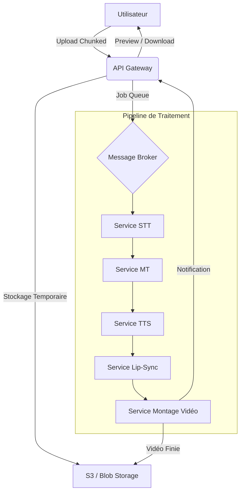
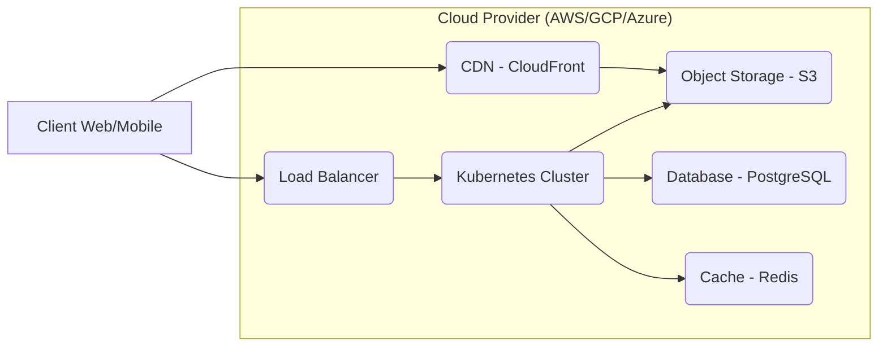

# Architecture du Système

Ce document décrit l'architecture technique de la plateforme de doublage.

## 1. Vue d'ensemble du Pipeline

Le pipeline de doublage est conçu comme une suite de microservices orchestrés de manière asynchrone.

## 2. Architecture Infrastructure (Cloud)

L'infrastructure utilise des services gérés pour garantir la scalabilité et la haute disponibilité.

## 3. Flux de Données et Sécurité

1.  **Ingestion :** Les fichiers sont chargés par segments via HTTPS (TLS 1.2+).
2.  **Validation :** Chaque segment est vérifié (somme de contrôle) et validé par l'API Gateway.
3.  **Traitement :** Les microservices communiquent via gRPC ou REST. Les données sensibles sont chiffrées au repos.
4.  **Conformité :** Un service de gestion du consentement vérifie les droits avant de lancer le traitement biométrique (voix).

## 4. Services IA Intégrés

-   **STT :** OpenAI Whisper (self-hosted) ou Google Speech-to-Text.
-   **MT :** DeepL API ou Google Cloud Translate.
-   **TTS :** Google Cloud TTS ou Microsoft Azure Neural TTS.
-   **Lip-Sync :** Wav2Lip (modèle PyTorch).
