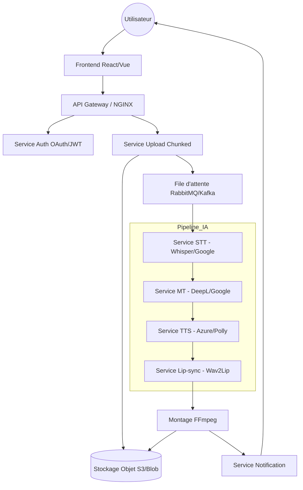

# Architecture du Système

## Composants Clés
- **Stockage** : PostgreSQL (Métadonnées), Redis (Cache), S3 (Médias).
- **CDN** : CloudFront pour la distribution.
- **Monitoring** : Prometheus & Grafana.
