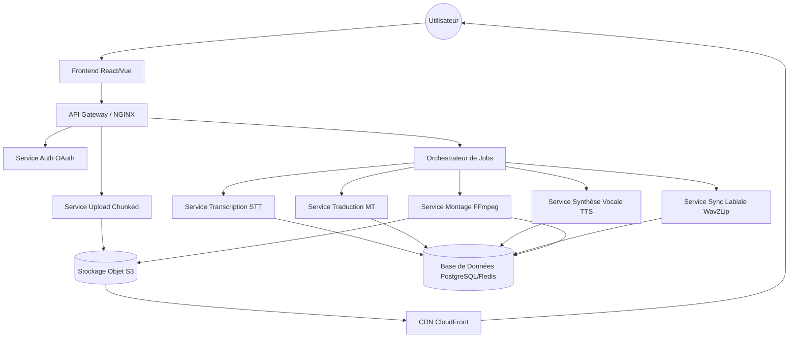

# Architecture du Système

## Architecture Globale (Mermaid)

## Pipeline de Traitement
1. **Ingestion** : Upload par morceaux vers S3.
2. **Transcription** : Extraction du texte via OpenAI Whisper ou Google STT.
3. **Traduction** : Traduction vers la langue cible via DeepL ou Google Translate.
4. **Synthèse** : Génération de la voix via Azure TTS ou Amazon Polly (SSML).
5. **Alignement** : Synchronisation labiale via Wav2Lip.
6. **Assemblage** : Mixage final avec FFmpeg.

## Flux Utilisateur
1. Création de projet et upload.
2. Paramétrage (langue, voix).
3. Traitement asynchrone (file d'attente).
4. Prévisualisation et ajustements manuels.
5. Export et téléchargement.
